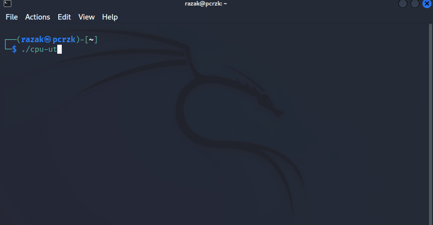

# CPU-Usage-Tracker



## ⚙️ Instalation

To build:
```bash
git clone https://github.com/DthRazak/CPU-Usage-Tracker.git
cd CPU-Usage-Tracker
mkdir build && cd build
cmake ..
```

## 📚 Documentation

You can build it locally (with Doxygen) by running the following commands:
```bash
cmake -DBUILD_WITH_DOCS=ON ..
make docs
```

## 📝 License

This project is licensed with the [MIT License](LICENSE).
